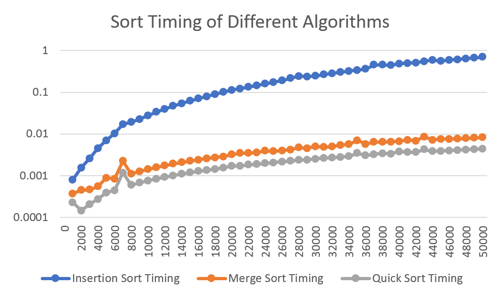
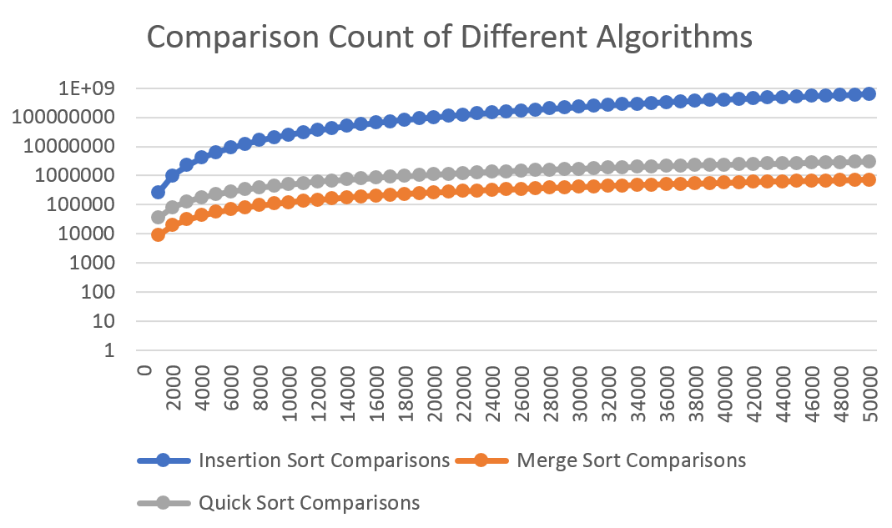
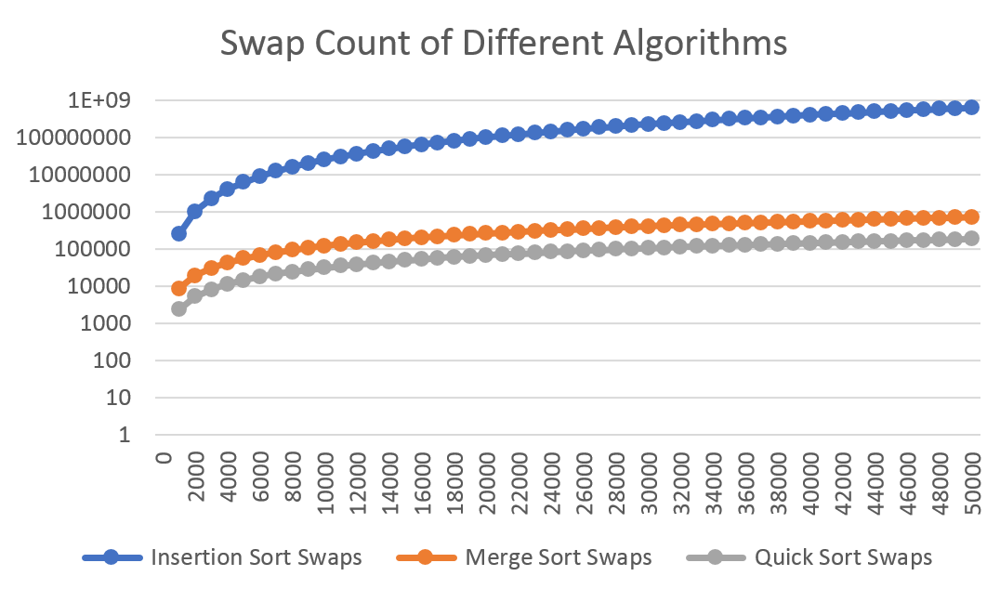
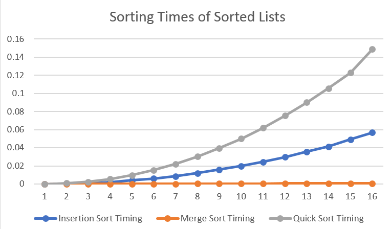
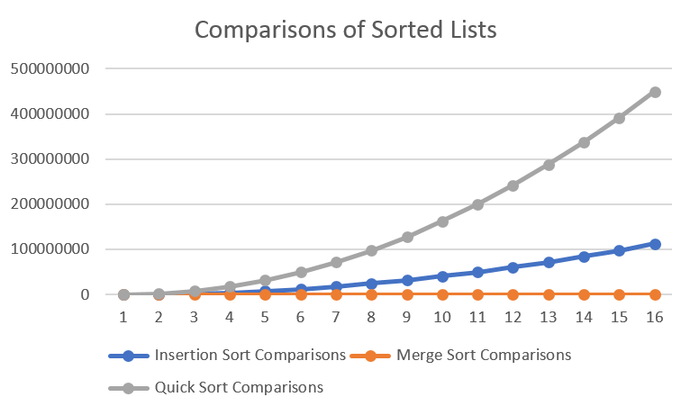
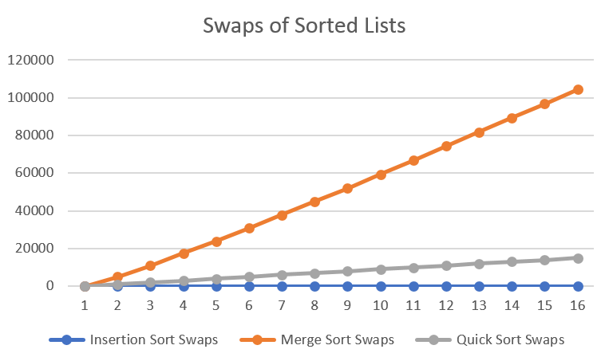

# Analysis of Sorting Algorithms

Key: 
 - {1,2,3} is the best to worst rating, 1 being best, 3 being worst

If you would like to analyze the data sets yourself, there are two .csv's. Analysis.csv & SortedAnalysis.csv both have all the data in a comma-seperated format to look at using any excel program.

---

### Insertion Sort
Expected Performance: 3

Actual Performance: 3
 - Random Data Set
     - Timing: 3
     - Swaps: 3
     - Comparisons: 3
 - Sorted Data Set
     - Timing: 2
     - Swaps: 1
     - Comparisons: 2

---

### Merge Sort
Expected Performance: 1

Actual Performance: 2
 - Random Data Set
     - Timing: 2
     - Swaps: 2
     - Comparisons: 1
 - Sorted Data Set
     - Timing: 1
     - Swaps: 2
     - Comparisons: 1

---

### Quick Sort
Expected Performance: 2

Actual Performance: 1
 - Random Data Set
     - Timing: 1
     - Swaps: 1
     - Comparisons: 2
 - Sorted Data Set
     - Timing: 3
     - Swaps: 3
     - Comparisons: 3 

---

### Graphs
Here are some graphs of the timing, comparisons, and swap counts of the algorithms all using random data sets:

---
And these are the graphs of everything with sorted data sets:

